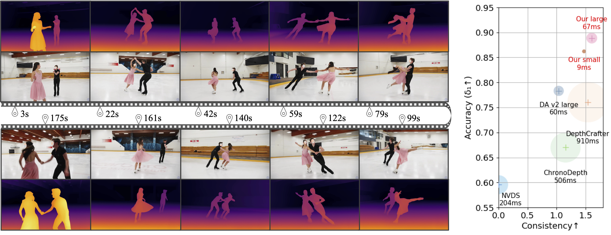
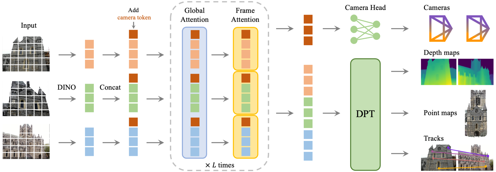
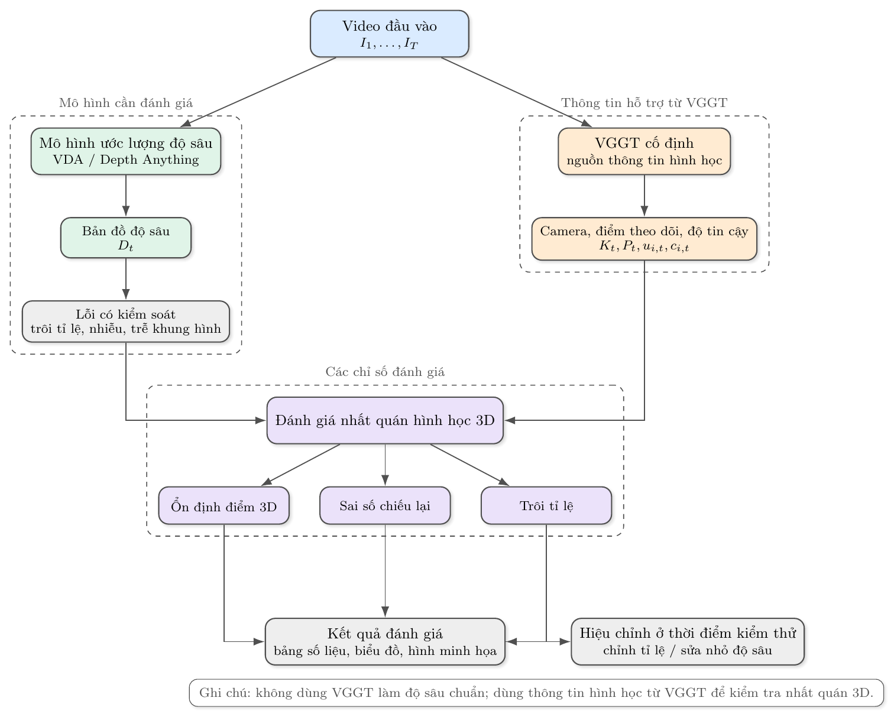

# ĐỀ CƯƠNG NGHIÊN CỨU

## 1. Tên đề tài tiếng Việt

**Đánh giá và hiệu chỉnh tính nhất quán hình học 3D cho ước lượng độ sâu video bằng VGGT**

## 2. Tên đề tài tiếng Anh

**VGGT-Guided Evaluation and Test-Time Adaptation for 3D-Consistent Video Depth Estimation**

## 3. Tóm tắt

Đề tài này đề xuất xây dựng một quy trình đánh giá nhằm kiểm tra tính nhất quán hình học 3D của các mô hình ước lượng độ sâu từ video. Vấn đề chính được đặt ra là một chuỗi bản đồ độ sâu có thể nhìn mượt giữa các khung hình nhưng vẫn chưa đúng về mặt hình học khi camera di chuyển, chẳng hạn bị trôi tỉ lệ, lệch vị trí 3D hoặc làm biến dạng cấu trúc cảnh.

Trong nghiên cứu này, VGGT không được dùng như dữ liệu đúng tuyệt đối để chấm trực tiếp kết quả của mô hình khác. Thay vào đó, VGGT được xem là nguồn tín hiệu hình học hỗ trợ, vì mô hình này có thể cung cấp nhiều thông tin cùng lúc như tham số camera, vị trí camera, điểm 3D, điểm được theo dõi qua nhiều khung hình và độ tin cậy của các điểm đó. Các tín hiệu này được dùng để kiểm tra xem bản đồ độ sâu do một mô hình khác tạo ra có hình thành cấu trúc 3D ổn định qua thời gian hay không.

Ví dụ, nếu cùng một điểm trên vật thể được quan sát trong nhiều khung hình, khi dùng độ sâu dự đoán để đưa điểm đó vào không gian 3D, vị trí của điểm này cần tương đối ổn định sau khi quy về cùng một hệ tọa độ. Nếu vị trí 3D thay đổi quá nhiều, điều đó cho thấy bản đồ độ sâu có thể chưa nhất quán theo thời gian hoặc chưa đúng về mặt hình học. Để tránh phụ thuộc quá mức vào VGGT, các chỉ số đánh giá sẽ được kiểm chứng bằng lỗi được tạo có kiểm soát, dữ liệu có độ sâu thật hoặc camera thật nếu có, và các hình minh họa trực quan.

## 4. Giới thiệu

Ước lượng độ sâu từ video là một bài toán quan trọng trong thị giác máy tính, có thể được ứng dụng trong robot, xe tự hành, thực tế tăng cường, dựng lại không gian 3D và định vị camera. Với mỗi khung hình trong video, mô hình cần dự đoán khoảng cách từ camera đến các điểm trong cảnh.

Các mô hình gần đây như Depth Anything, Depth Anything V2 và Video Depth Anything đã cho kết quả tốt về mặt hình ảnh. Bản đồ độ sâu được tạo ra thường rõ ràng hơn, ít nhiễu hơn và ổn định hơn qua thời gian. Tuy nhiên, ổn định về mặt hình ảnh chưa đồng nghĩa với đúng về mặt hình học. Một chuỗi bản đồ độ sâu có thể nhìn mượt nhưng vẫn bị sai tỉ lệ, bị lệch khi camera di chuyển, hoặc làm cùng một vật thể bị biến dạng trong không gian 3D.

*Hình 1. Minh họa kết quả của Video Depth Anything trên video dài. Mô hình hướng tới việc tạo bản đồ độ sâu ổn định theo thời gian. Nguồn: trang dự án Video Depth Anything.*

Các cách đánh giá phổ biến như sai số độ sâu trung bình hoặc độ mượt theo thời gian thường chưa đủ để phát hiện các lỗi này. Trong nhiều trường hợp, dữ liệu thật về độ sâu và camera cũng không có sẵn đầy đủ, làm cho việc đánh giá càng khó hơn. Vì vậy, cần có một cách đánh giá bổ sung, tập trung vào việc kiểm tra tính nhất quán của cấu trúc 3D được suy ra từ chuỗi bản đồ độ sâu.

VGGT là một mô hình thị giác 3D có khả năng ước lượng nhiều thông tin hình học từ ảnh hoặc video. Ngoài bản đồ độ sâu, VGGT còn có thể cung cấp thông tin về camera và các điểm được theo dõi qua nhiều khung hình. Do đó, đề tài đề xuất dùng các thông tin này như tín hiệu hỗ trợ để xây dựng chỉ số đánh giá, thay vì xem VGGT là chuẩn đúng tuyệt đối. Trọng tâm của đề tài là thiết kế quy trình đánh giá, kiểm chứng độ nhạy của các chỉ số bằng lỗi có kiểm soát, và xem xét khả năng hiệu chỉnh nhẹ kết quả ở thời điểm kiểm thử nếu tín hiệu đánh giá đủ ổn định.

*Hình 2. Kiến trúc tổng quát của VGGT. Mô hình nhận nhiều ảnh đầu vào và dự đoán đồng thời thông tin camera, bản đồ độ sâu, bản đồ điểm 3D và điểm theo dõi. Đây là lý do đề tài dùng VGGT như nguồn thông tin hình học hỗ trợ, thay vì dùng VGGT như dữ liệu đúng tuyệt đối. Nguồn: trang dự án VGGT.*

Đầu vào của đề tài là video ngắn, bản đồ độ sâu dự đoán và các tín hiệu hình học hỗ trợ; đầu ra là các chỉ số, bảng so sánh và hình minh họa giúp đánh giá mức độ nhất quán hình học 3D của video độ sâu.

## 5. Mục tiêu

Mục tiêu tổng quát của đề tài là xây dựng một quy trình đánh giá và hiệu chỉnh nhẹ để xem kết quả ước lượng độ sâu từ video có nhất quán trong không gian 3D hay không.

Các mục tiêu cụ thể gồm:

1. Nghiên cứu cách sử dụng thông tin hình học từ VGGT, gồm camera, điểm theo dõi và độ tin cậy, để hỗ trợ đánh giá độ sâu video mà không xem VGGT là dữ liệu đúng tuyệt đối.
2. Đề xuất và kiểm chứng một nhóm chỉ số đánh giá tính nhất quán hình học 3D dựa trên độ ổn định của điểm theo dõi, sai số chiếu lại lên ảnh và độ trôi tỉ lệ theo thời gian.
3. Xây dựng quy trình thử nghiệm với lỗi có kiểm soát và dữ liệu có sẵn; từ đó đánh giá khả năng dùng các chỉ số hình học làm tín hiệu hiệu chỉnh nhẹ ở thời điểm kiểm thử.

## 6. Nội dung và phương pháp

### 6.1. Phạm vi, đầu vào và đầu ra

Đề tài tập trung vào đánh giá tính nhất quán hình học 3D của bản đồ độ sâu video trên các bộ dữ liệu có sẵn, không đặt mục tiêu tạo bộ dữ liệu chuẩn mới hoặc huấn luyện một mô hình ước lượng độ sâu mới từ đầu. Phần hiệu chỉnh ở thời điểm kiểm thử chỉ được xem là thử nghiệm phụ sau khi các chỉ số đánh giá đã được kiểm chứng sơ bộ; trọng tâm chính của đề tài vẫn là thiết kế và kiểm chứng quy trình đánh giá.

Đầu vào dự kiến gồm video ngắn khoảng 8 đến 64 khung hình, ảnh màu của từng khung hình, bản đồ độ sâu do mô hình cần đánh giá tạo ra, thông tin hình học do VGGT cung cấp, và độ sâu thật hoặc vị trí camera thật nếu bộ dữ liệu có sẵn. Để bảo đảm tính khả thi, đề tài ưu tiên chọn TUM RGB-D và Sintel làm dữ liệu thử nghiệm chính vì có thông tin hình học hỗ trợ kiểm chứng; KITTI hoặc ScanNet chỉ được dùng bổ sung nếu thời gian và tài nguyên tính toán cho phép.

Đầu ra dự kiến gồm nhóm chỉ số đánh giá tính nhất quán hình học 3D, bảng hoặc biểu đồ thể hiện sai số theo mức độ lỗi, hình minh họa trực quan bằng điểm theo dõi và điểm chiếu lại, cùng một chương trình hoặc sổ tay thử nghiệm nhỏ nếu cần minh họa tính khả thi.

### 6.2. Quy trình nghiên cứu

*Hình 3. Sơ đồ tổng quát của đề tài. Video đầu vào được đưa qua mô hình ước lượng độ sâu và VGGT. Độ sâu dự đoán được đánh giá bằng các thông tin hình học do VGGT cung cấp, sau đó có thể được hiệu chỉnh nhẹ ở thời điểm kiểm thử.*

Quy trình nghiên cứu gồm bốn bước chính. Thứ nhất, các công trình liên quan về ước lượng độ sâu, thị giác 3D và dữ liệu đánh giá sẽ được khảo sát để xác định mô hình tạo độ sâu, nguồn thông tin hình học và bộ dữ liệu phù hợp. Các mô hình như Depth Anything, Depth Anything V2 hoặc Video Depth Anything có thể được dùng để tạo bản đồ độ sâu cần đánh giá; VGGT được dùng để cung cấp tín hiệu hình học hỗ trợ.

Thứ hai, một số đoạn video ngắn sẽ được chọn từ các bộ dữ liệu có sẵn. Các đoạn này cần có chuyển động camera hoặc thay đổi góc nhìn đủ rõ để kiểm tra tính nhất quán hình học. Dữ liệu trung gian sẽ được chuẩn hóa ở mức cần thiết, gồm ảnh, độ sâu dự đoán, tham số camera, vị trí camera, tọa độ điểm theo dõi, trạng thái hợp lệ và độ tin cậy nếu có.

Thứ ba, đề tài tạo các phiên bản độ sâu bị lỗi có kiểm soát từ bản đồ độ sâu ban đầu. Các lỗi dự kiến gồm trôi tỉ lệ theo thời gian, nhiễu theo thời gian, trễ khung hình, méo cục bộ và làm mượt quá mức. Vì mức độ lỗi được kiểm soát, một chỉ số đánh giá phù hợp cần phản ánh được thứ tự từ độ sâu ban đầu, lỗi nhẹ đến lỗi nặng.

Thứ tư, các chỉ số đánh giá sẽ được tính trên độ sâu ban đầu và các phiên bản bị lỗi. Kết quả được phân tích bằng bảng số liệu, biểu đồ và hình minh họa trực quan để xem chỉ số có phát hiện được lỗi hình học hay không.

### 6.3. Chỉ số đánh giá và kiểm chứng

Đề tài dự kiến xây dựng ba nhóm chỉ số. Nhóm thứ nhất là độ ổn định 3D của điểm theo dõi. Với một điểm được quan sát qua nhiều khung hình, tọa độ ảnh và độ sâu tại từng khung hình được dùng để đưa điểm đó vào không gian 3D. Sau đó, các điểm 3D được quy về cùng một hệ tọa độ bằng thông tin camera. Nếu độ sâu nhất quán, các vị trí 3D của cùng một điểm vật lý cần gần nhau; nếu chúng phân tán quá xa, độ sâu có thể chưa ổn định về mặt hình học.

Nhóm thứ hai là sai số chiếu lại lên ảnh. Một điểm 3D được tạo từ khung hình này sẽ được chiếu sang khung hình khác bằng thông tin camera, sau đó so sánh với vị trí điểm theo dõi trên ảnh. Chỉ số này giúp phát hiện trường hợp bản đồ độ sâu nhìn mượt nhưng không tạo ra chuyển động hình học phù hợp với camera.

Nhóm thứ ba là độ trôi tỉ lệ theo thời gian. Vì độ sâu từ một camera thường khó xác định đúng tỉ lệ tuyệt đối, đề tài cần tách riêng lỗi trôi tỉ lệ khỏi các lỗi hình học khác. Nhóm chỉ số này giúp phân biệt trường hợp hình dạng tương đối đúng nhưng tỉ lệ thay đổi bất thường, với trường hợp độ sâu bị sai cục bộ hoặc biến dạng mạnh.

Các chỉ số trên sẽ được kiểm chứng theo ba hướng. Một là kiểm tra xếp hạng: độ sâu ban đầu cần có sai số thấp hơn độ sâu đã bị tạo lỗi. Hai là kiểm tra tăng dần: sai số cần tăng khi mức độ lỗi tăng. Ba là kiểm tra tương quan: nếu có dữ liệu thật, chỉ số đề xuất sẽ được so sánh với các sai số truyền thống như AbsRel, RMSE hoặc sai số chiếu lại. Ngoài số liệu, hình minh họa sẽ được dùng để phát hiện các trường hợp thất bại, đặc biệt là khi VGGT hoặc điểm theo dõi không ổn định.

### 6.4. Hiệu chỉnh ở thời điểm kiểm thử và giảm rủi ro

Sau khi các chỉ số đánh giá hình học được kiểm chứng, đề tài có thể xem xét dùng chúng để hiệu chỉnh kết quả độ sâu ở thời điểm kiểm thử. Đây là phần thử nghiệm phụ, không phải tiêu chí chính để đánh giá thành công của đề tài. Mục tiêu của bước này không phải là huấn luyện lại toàn bộ mô hình, mà là điều chỉnh nhẹ kết quả của từng video để làm cho độ sâu nhất quán hơn về mặt hình học. Các hướng thử nghiệm có thể gồm hiệu chỉnh tỉ lệ và độ lệch theo video, thêm phần sửa nhỏ trên bản đồ độ sâu, hoặc chỉ điều chỉnh một phần nhỏ của mô hình nếu có điều kiện.

Một số rủi ro chính gồm VGGT không phải dữ liệu đúng tuyệt đối, nhầm quy ước camera, vật thể chuyển động, dữ liệu không thống nhất giữa các bộ dữ liệu và chi phí tính toán cao. Để giảm rủi ro, đề tài sẽ dùng lỗi có kiểm soát, so sánh với dữ liệu thật nếu có, kiểm tra trực quan bằng điểm chiếu lại, ưu tiên video ngắn và lưu kết quả trung gian để tránh chạy lại toàn bộ quy trình.

## 7. Kết quả mong đợi

Kết quả mong đợi của đề tài bao gồm:

1. **Quy trình đánh giá tính nhất quán hình học 3D** cho video độ sâu, được cụ thể hóa qua ba nhóm chỉ số đo lường: mức độ ổn định 3D của các điểm theo vết, sai số chiếu lại trên mặt phẳng ảnh, và độ trôi tỉ lệ theo thời gian.
2. **Quy trình thực nghiệm với sai số có kiểm soát** nhằm kiểm chứng độ nhạy của các chỉ số đề xuất. Kết quả được định lượng qua hệ thống bảng số liệu, biểu đồ độ nhạy và hình ảnh trực quan đối chiếu giữa các mức độ nhiễu khác nhau (độ sâu nguyên bản, lỗi nhẹ và lỗi nặng).
3. **Báo cáo phân tích tương quan** giữa nhóm chỉ số hình học đề xuất và các sai số truyền thống (như AbsRel, RMSE) trên các bộ dữ liệu có độ sâu chuẩn (ground truth), giúp xác định rõ giá trị bổ trợ của các chỉ số mới.
4. **Kết quả thử nghiệm hiệu chỉnh thích ứng tại thời điểm kiểm thử (test-time adaptation)**, đóng vai trò minh họa khả năng ứng dụng thực tế của quy trình đánh giá trong việc tinh chỉnh và nâng cao tính nhất quán hình học của bản đồ độ sâu video.

## 8. Tài liệu tham khảo

[1]. Jianyuan Wang, Minghao Chen, Nikita Karaev, Andrea Vedaldi, Christian Rupprecht, David Novotny: VGGT: Visual Geometry Grounded Transformer. CVPR 2025: 5294-5306.

[2]. Sili Chen, Hengkai Guo, Shengnan Zhu, Feihu Zhang, Zilong Huang, Jiashi Feng, Bingyi Kang: Video Depth Anything: Consistent Depth Estimation for Super-Long Videos. CVPR 2025: 22831-22840.

[3]. Lihe Yang, Bingyi Kang, Zilong Huang, Zhen Zhao, Xiaogang Xu, Jiashi Feng, Hengshuang Zhao: Depth Anything V2. NeurIPS 2024.

[4]. Lihe Yang, Bingyi Kang, Zilong Huang, Xiaogang Xu, Jiashi Feng, Hengshuang Zhao: Depth Anything: Unleashing the Power of Large-Scale Unlabeled Data. CVPR 2024: 10371-10381.

[5]. Zhengqi Li, Richard Tucker, Forrester Cole, Qianqian Wang, Linyi Jin, Vickie Ye, Angjoo Kanazawa, Aleksander Holynski, Noah Snavely: MegaSaM: Accurate, Fast and Robust Structure and Motion from Casual Dynamic Videos. CVPR 2025: 10486-10496.

[6]. Andreas Geiger, Philip Lenz, Raquel Urtasun: Are we ready for Autonomous Driving? The KITTI Vision Benchmark Suite. CVPR 2012: 3354-3361.

[7]. Daniel J. Butler, Jonas Wulff, Garrett B. Stanley, Michael J. Black: A Naturalistic Open Source Movie for Optical Flow Evaluation. ECCV 2012: 611-625.

[8]. Jürgen Sturm, Nikolas Engelhard, Felix Endres, Wolfram Burgard, Daniel Cremers: A Benchmark for the Evaluation of RGB-D SLAM Systems. IROS 2012: 573-580.

[9]. Angela Dai, Angel X. Chang, Manolis Savva, Maciej Halber, Thomas A. Funkhouser, Matthias Nießner: ScanNet: Richly-annotated 3D Reconstructions of Indoor Scenes. CVPR 2017: 5828-5839.
