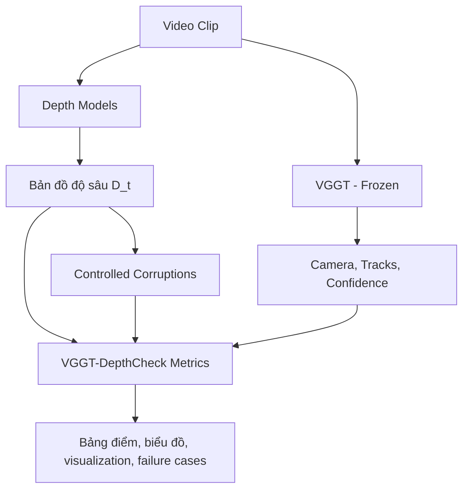

# ĐỀ CƯƠNG NGHIÊN CỨU: VGGT-DEPTHCHECK
> **Đề tài đề xuất:** VGGT-DepthCheck: A Diagnostic Stress-Test Suite and Proxy Geometric Critic for 3D-Consistent Video Depth Estimation  
> **Tác giả:** Độc lập (Independent Researcher)  
> **Mục tiêu:** Xây dựng đóng góp nghiên cứu khả thi cho nhà nghiên cứu độc lập, hướng tới workshop/main-track CVPR, ICCV, NeurIPS hoặc ICLR.

---

## 1. Đặt Vấn Đề & Động Lực Nghiên Cứu

Các mô hình ước lượng độ sâu từ video như **Video Depth Anything (VDA)** đã cải thiện mạnh về chất lượng trực quan và độ ổn định thời gian. Tuy nhiên, một câu hỏi vẫn còn mở:

> Một chuỗi depth nhìn mượt theo thời gian có thật sự nhất quán trong không gian 3D khi camera di chuyển không?

Các metric phổ biến như AbsRel, RMSE hoặc temporal smoothness chưa luôn phản ánh đúng lỗi hình học 3D. Một mô hình có thể tạo depth mượt nhưng vẫn làm vật thể bị co giãn, trôi scale, hoặc biến dạng khi chiếu qua nhiều góc nhìn.

Trong khi đó, **VGGT (Visual Geometry Grounded Transformer)** có khả năng dự đoán nhiều tín hiệu hình học từ ảnh/video, gồm camera, depth/point maps và 3D point tracks. Tuy nhiên, VGGT không nên được xem là ground truth tuyệt đối. Trong nghiên cứu này, VGGT được dùng như một **learned geometric proxy**: một nguồn tín hiệu hình học mạnh để xây dựng metric chẩn đoán và loss phụ trợ.

> **Ý tưởng cốt lõi:** Sử dụng VGGT đã huấn luyện sẵn, đóng băng, để xây dựng một bộ kiểm thử chẩn đoán độ nhất quán hình học 3D của video depth. Trọng tâm Pha 1 là kiểm chứng metric bằng controlled corruptions, ground-truth datasets và visualization, chưa cần huấn luyện mô hình.

---

## 2. Câu Hỏi Nghiên Cứu

### RQ1: VGGT-derived metrics có phát hiện được lỗi 3D temporal inconsistency không?

Nếu ta cố tình làm depth bị flicker, scale jitter, frame delay hoặc local warping, metric đề xuất có tăng theo mức độ lỗi không?

### RQ2: Metric đề xuất có tương quan với lỗi hình học thật không?

Trên các dataset có ground truth depth/pose như KITTI, Sintel, TUM RGB-D hoặc ScanNet, metric có tương quan với AbsRel, RMSE, pose/reconstruction error hoặc reprojection error không?

### RQ3: Metric này có hữu ích hơn temporal smoothness thông thường không?

Một depth video mượt chưa chắc đúng hình học. Nghiên cứu cần chứng minh metric VGGT-derived phát hiện được các lỗi mà optical-flow/temporal-smoothness metric bỏ sót.

---

## 3. Đóng Góp Dự Kiến

1. **VGGT-DepthCheck:** một evaluation/stress-test suite cho 3D temporal consistency trong video depth estimation, không yêu cầu tạo dataset ground truth mới.
2. **Bộ metric hình học dựa trên track và reprojection**, gồm Track-based 3D Consistency, Reprojection Consistency, Scale Drift và Coverage/Confidence.
3. **Controlled corruption protocol** để kiểm tra độ nhạy của metric với các lỗi depth có kiểm soát.
4. **Phân tích thực nghiệm trên nhiều mô hình depth**, ví dụ VDA, Depth Anything V2 frame-by-frame, Depth Anything 3 nếu chạy được, và các baseline video depth khác.

---

## 4. Phương Pháp Đề Xuất

Luồng tổng quát:

### 4.1 Tín Hiệu Đầu Vào

Với mỗi video clip gồm 16-64 frames:

- Ảnh gốc: \(I_t\)
- Depth từ mô hình cần đánh giá: \(D_t\)
- Camera/intrinsics/tracks/confidence từ VGGT: \(K_t, P_t, T_i, c_i\)
- Ground truth depth/pose nếu dataset có

### 4.2 Metric 1: Track-based 3D Consistency

Với một track \(i\) xuất hiện ở nhiều frame, lấy pixel \(u_{i,t}\) và depth dự đoán \(D_t(u_{i,t})\). Back-project điểm này về 3D, rồi đưa về cùng hệ tọa độ world bằng pose từ VGGT:

\[
X_{i,t}^{world} = P_t^{-1} \cdot \pi^{-1}(u_{i,t}, D_t(u_{i,t}), K_t)
\]

Nếu depth nhất quán, cùng một track phải tạo ra các điểm 3D gần nhau qua thời gian:

\[
VT3D_i = median_t \|X_{i,t}^{world} - median_s(X_{i,s}^{world})\|
\]

\[
VT3D = median_i(VT3D_i)
\]

Metric này đo độ ổn định 3D nội tại của depth model dựa trên correspondence/camera proxy từ VGGT.

### 4.3 Metric 2: Reprojection Consistency

Từ điểm ở frame \(t\), back-project bằng depth model, rồi chiếu sang frame \(s\). So sánh vị trí chiếu được với track tương ứng:

\[
RCE_{i,t,s} = \|\hat{u}_{i,s} - u_{i,s}\|
\]

Trong đó:

\[
\hat{u}_{i,s} = \pi(K_s, P_s P_t^{-1} \pi^{-1}(u_{i,t}, D_t(u_{i,t}), K_t))
\]

Metric cuối:

\[
RCE = median_{i,t,s}(RCE_{i,t,s})
\]

RCE dễ trực quan hóa vì có thể vẽ điểm track thật và điểm chiếu lại trên ảnh.

### 4.4 Metric 3: Scale Drift

Depth monocular có scale ambiguity, nên cần tách lỗi scale khỏi lỗi consistency. Với mỗi frame, ước lượng scale giữa depth model và depth/geometry proxy:

\[
scale_t = median_i \frac{z^{proxy}_{i,t}}{z^{model}_{i,t}}
\]

Độ trôi scale theo thời gian:

\[
ScaleDrift = std_t(\log scale_t)
\]

Khi báo cáo kết quả, cần có cả:

- **Aligned metrics:** sau khi align scale/shift hoặc Sim(3) theo clip.
- **Raw scale drift:** đo riêng mức độ trôi scale theo thời gian.

### 4.5 Masking & Robustness

Để tránh metric bị nhiễu bởi vùng không đáng tin, chỉ tính trên các điểm thỏa:

- VGGT confidence đủ cao
- Track xuất hiện đủ dài, ví dụ ít nhất 5 frames
- Không nằm ở vùng occlusion rõ ràng
- Không thuộc vùng dynamic object nếu có mask
- Depth không bất thường, không quá gần/quá xa

Loss/metric nên dùng robust penalty như Huber hoặc Tukey thay vì L2 thuần.

---

## 5. Pha 1: Diagnostic Stress-Test Suite

Pha 1 là trọng tâm khả thi nhất và có thể đứng độc lập như một bài diagnostic/evaluation paper.

### 5.1 Không Tạo Dataset Mới Từ Đầu

Benchmark ở đây không phải là tự thu thập và annotate dataset mới. Thay vào đó:

> Benchmark = existing datasets + clip selection protocol + controlled corruptions + VGGT-derived metrics + baseline results + visualization.

Dataset đề xuất:

- **Sintel:** synthetic, phù hợp để kiểm tra lỗi hình học và chuyển động.
- **KITTI:** video lái xe ngoài trời, có depth/pose tương đối tốt.
- **TUM RGB-D hoặc ScanNet:** indoor, có RGB-D/pose.
- **DAVIS hoặc casual videos:** dùng cho qualitative analysis, không cần ground truth.

### 5.2 Controlled Corruptions

Từ depth sạch \(D_t\), tạo các biến thể lỗi \(D'_t\) với mức độ tăng dần:

- **Scale jitter:** nhân depth mỗi frame với scale ngẫu nhiên.
- **Temporal flicker:** thêm noise thay đổi theo thời gian.
- **Frame delay:** dùng depth của frame \(t-1\) cho frame \(t\).
- **Local warping:** làm méo depth ở một vùng ảnh.
- **Object inconsistency:** làm depth vùng người/xe thay đổi bất thường.
- **Over-smoothing:** làm depth quá mượt, mất chi tiết hình học.

Vì lỗi được tạo có kiểm soát, ta biết thứ tự mong muốn:

\[
clean < mild corruption < strong corruption
\]

Một metric tốt phải xếp hạng đúng thứ tự này.

### 5.3 Validation Protocol

Metric được kiểm chứng bằng ba hướng:

1. **Ranking test:** metric phải chấm clean depth tốt hơn corrupted depth.
2. **Monotonicity test:** lỗi metric phải tăng khi mức corruption tăng.
3. **Correlation test:** trên dataset có ground truth, metric phải tương quan với AbsRel, RMSE, pose/reconstruction error hoặc reprojection error.

Ngoài ra cần có visualization:

- Biểu đồ lỗi theo frame.
- Heatmap lỗi trên ảnh.
- Overlay track thật và điểm reprojection.
- Video so sánh clean/corrupted/model outputs.

---

## 6. Pha 2: Test-Time Adaptation

Sau khi Pha 1 chứng minh metric có ý nghĩa, có thể dùng metric như một loss phụ trợ cho test-time adaptation.

Thứ tự nên đi từ nhẹ đến nặng:

1. **Optimize per-video scale/shift:** chỉ tối ưu scale và shift của depth theo clip.
2. **Optimize small depth correction field:** học một correction map nhỏ, regularized mạnh.
3. **LoRA/adapter TTA:** chỉ tối ưu một số tham số rất nhỏ của mô hình.

Không nên bắt đầu bằng việc tối ưu toàn bộ VDA, vì dễ overfit, tốn VRAM và khó chứng minh cải thiện tổng quát.

---

## 7. Pha 3: PEFT/LoRA Fine-tuning

Nếu Pha 2 có tín hiệu tích cực, tiến tới fine-tune bằng PEFT/LoRA trên 100-200 video ngắn. VGGT vẫn đóng băng và chỉ cung cấp proxy geometric loss.

Điều kiện khả thi:

- Dùng clip ngắn, ví dụ 8-16 frames.
- Giảm resolution khi training.
- Tích lũy gradient nếu VRAM hạn chế.
- Mục tiêu thực tế hơn: 24GB GPU là mốc an toàn; dưới 16GB chỉ nên xem là mục tiêu tối ưu hóa, không phải cam kết.

---

## 8. Rủi Ro Chính & Cách Giảm Thiểu

| Rủi ro | Vấn đề | Cách giảm thiểu |
| :--- | :--- | :--- |
| VGGT không phải ground truth | Reviewer có thể nói metric chỉ đo agreement với VGGT | Dùng controlled corruptions, GT correlation và so sánh với SfM/SLAM/flow metrics |
| Scale ambiguity | Depth monocular không có scale tuyệt đối | Báo cáo aligned metrics và scale drift riêng |
| Dynamic objects | Vật thể chuyển động làm sai giả định scene tĩnh | Confidence mask, dynamic mask, robust loss |
| Pose convention sai | Dễ nhầm world-to-camera/camera-to-world | Debug bằng reprojection visualization trước khi chạy lớn |
| Baseline mới mạnh hơn | Depth Anything 3 hoặc các model mới có thể thay đổi landscape | Cập nhật baseline và định vị contribution là diagnostic/protocol, không chỉ cải thiện VDA |

---

## 9. Kế Hoạch Hành Động

- [ ] **Bước 1:** Thiết lập môi trường chạy VDA, Depth Anything V2/3 nếu khả thi, và VGGT.
- [ ] **Bước 2:** Chọn 5-10 clip ngắn từ Sintel/KITTI/TUM để làm MVP.
- [ ] **Bước 3:** Chạy inference để lưu depth, camera, tracks và confidence ra `.npy` hoặc `.npz`.
- [ ] **Bước 4:** Implement Reprojection Consistency trước vì dễ debug bằng visualization 2D.
- [ ] **Bước 5:** Implement Track-based 3D Consistency và Scale Drift.
- [ ] **Bước 6:** Tạo controlled corruptions với nhiều mức độ.
- [ ] **Bước 7:** Chạy ranking/monotonicity/correlation tests.
- [ ] **Bước 8:** Xuất bảng kết quả, biểu đồ, heatmap và failure cases.

---

## 10. Kết Luận

Đề tài khả thi nhất nếu bắt đầu từ **VGGT-DepthCheck**, một bộ kiểm thử chẩn đoán thay vì huấn luyện ngay. Điểm mạnh của hướng này là ít tốn GPU, không cần annotate dataset mới, nhưng vẫn có contribution rõ ràng: định nghĩa và kiểm chứng một protocol đo độ nhất quán hình học 3D cho video depth.

Nếu Pha 1 chứng minh metric đáng tin, Pha 2 và Pha 3 mới có nền tảng vững để dùng VGGT như proxy geometric loss nhằm cải thiện video depth estimation.
